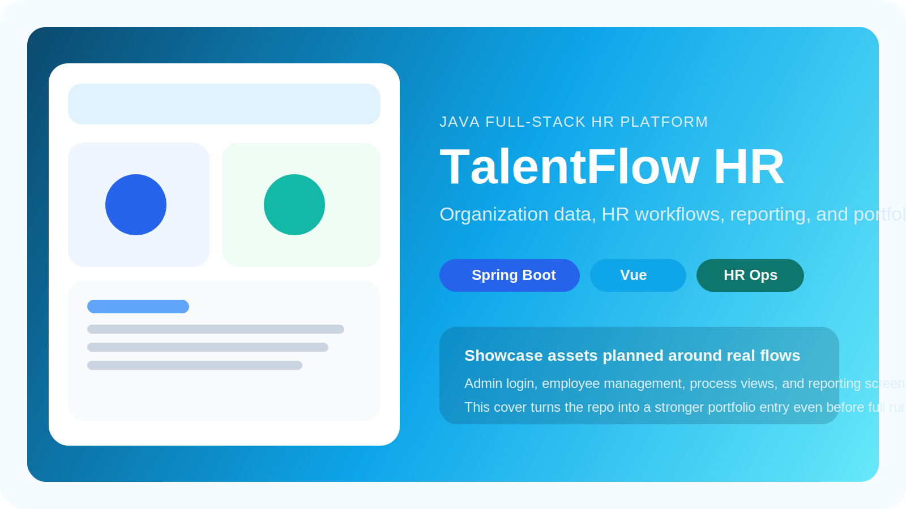
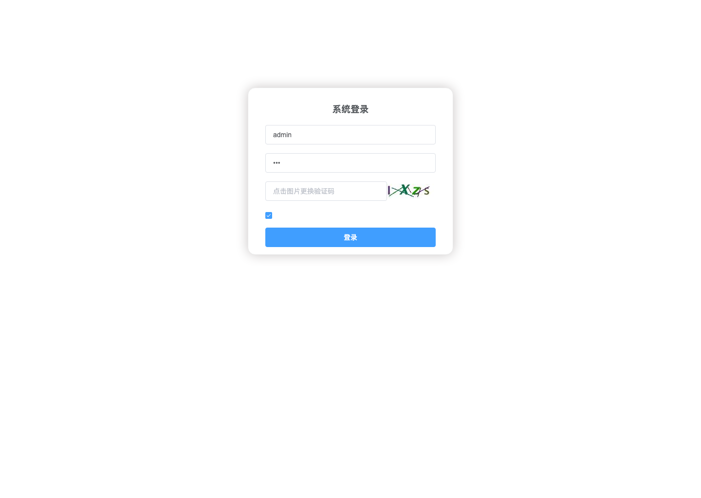

# talentflow-hr - 人力资源管理平台 | Human Resource Management Platform

[](https://github.com/however-yir/talentflow-hr/actions/workflows/talentflow-smoke.yml)
[](https://github.com/however-yir/talentflow-hr#readme)
[](./LICENSE)
[](https://github.com/however-yir/talentflow-hr)
[](https://github.com/however-yir/however-yir#project-map)

> Status: `showcase-ready`
>
> Upstream origin: `lenve/vhr`

> **非官方声明（Non-Affiliation）**  
> 本仓库为社区维护的衍生/二次开发版本，与上游项目及其权利主体不存在官方关联、授权背书或从属关系。  
> **商标声明（Trademark Notice）**  
> 相关项目名称、Logo 与商标归其各自权利人所有。本仓库仅用于说明兼容/来源，不主张任何商标权利。
>
> License note: upstream repository currently has no detected GitHub license file, so this fork ships a scoped `LICENSE` notice for fork-authored documentation and showcase assets only.
>
> Attribution: see `LICENSE`, `LICENSE.HOWEVER`, `NOTICE.md`, and `LICENSE_STATUS.md` for redistribution boundaries and current verification status.

🔥 面向人事业务数字化的 Spring Boot + Vue 项目，覆盖组织、审批、报表与后台管理。  
🚀 当前重点是把传统二开仓库升级成“更适合作品集展示与后续工程化迭代”的独立项目。  
⭐ 适合放在 Java 全栈产品化作品线里，与 `nebulacms`、`aurora-mall` 一起看。



## 项目快照

- 定位：Java 全栈人力资源管理平台。
- 亮点：组织与流程场景、前后端分离、数据库初始化资源、范围受限的正式 LICENSE、后续可继续做 CI 与截图展示。
- 最短运行路径：`cd talentflow-platform && mvn -B clean verify`
- 合规提醒：请先阅读 `LICENSE`、`LICENSE.HOWEVER`、`LICENSE_STATUS.md` 与 `NOTICE.md`，不要把 scoped notice 误解为对全部上游代码的重新授权。

## Java 全栈作品线分工

| Repo | 主要角色 | 技术侧重 | 最适合的展示点 |
| --- | --- | --- | --- |
| `NebulaCMS` | 内容平台 | 插件系统、WebFlux、Vue 3 | 插件生态、内容管理、平台化 |
| `TalentFlow HR` | 业务后台 | Spring Boot + Vue | 组织流程、人事场景、后台系统 |
| `Aurora Mall` | 电商系统 | Spring Boot + MyBatis | 商品交易、配置治理、质量门禁 |

## 目录

- [1. 项目概述](#1-项目概述)
- [2. 目标与场景](#2-目标与场景)
- [3. 核心能力](#3-核心能力)
- [4. 技术栈](#4-技术栈)
- [5. 仓库结构](#5-仓库结构)
- [6. Quick Start](#6-quick-start)
- [7. 配置建议](#7-配置建议)
- [8. 开发与测试](#8-开发与测试)
- [9. 协作与发布](#9-协作与发布)
- [10. 路线图](#10-路线图)
- [11. 贡献指南](#11-贡献指南)
- [12. License](#12-license)

## 1. 项目概述

本仓库以工程化可维护为目标，强调文档清晰、结构稳定、可持续迭代。

## 2. 目标与场景

适用场景：

- 作为业务功能开发与验证的基础仓库。
- 作为团队内部协作与知识沉淀的载体。
- 作为后续扩展和二次开发的起点。

## 3. 核心能力

- 支持组织人事基础数据管理。
- 支持流程审批与业务协同。
- 支持统计报表与运营分析。

## 4. 技术栈

- Node.js / JavaScript
- Java / Spring
- Docker Compose

## 5. 仓库结构

建议优先阅读：

- README.md：项目入口与整体说明。
- docs 或同类目录：架构、规范、部署与 FAQ。
- 核心源码目录：按模块深入阅读。

## 6. Quick Start

1. 克隆仓库并进入目录：

```bash
git clone https://github.com/however-yir/talentflow-hr.git
cd talentflow-hr
```

2. 安装依赖并启动（按项目类型选择）：

```bash
cp .env.example .env

# Unified startup helper (doctor + infra-up + next steps)
./scripts/dev.sh all

# Initialize database schema
./scripts/dev.sh db-init

# Terminal 1: backend web
./scripts/dev.sh backend-web

# Terminal 2: backend mailserver
./scripts/dev.sh backend-mail

# Terminal 3: frontend
./scripts/dev.sh frontend
```

完成以上步骤后，默认可分别在 `8081` 和 Vue 开发端口观察后端与前端本地联调结果。

如果数据库是通过已有 `talentflow_hr.sql` 导入的旧库，首次启动建议保留 `SPRING_FLYWAY_BASELINE_ON_MIGRATE=true`，让 Flyway 为现有 schema 建立 baseline。

3. 最小验证建议：

- 依赖安装成功。
- 核心流程可运行。
- 基础测试或检查通过。

### 6.1 演示路径与截图位建议

当前仓库已补充真实登录页截图，后台多角色页面截图仍待补齐：



> 受本地环境影响（前端依赖链与缓存/基础服务配置），后台页面自动化截图链路尚未稳定，已记录为下一轮优先项。

| 场景 | 推荐展示内容 | 说明 |
|---|---|---|
| 登录与首页 | 后台登录后首页概览 | README 首屏或项目封面 |
| 组织与员工管理 | 员工列表、搜索、部门结构 | 展示数据管理能力 |
| 审批/业务流程 | 一条审批或流程状态链路 | 展示业务闭环 |
| 薪资/统计报表 | 表格、图表或统计页 | 展示运营分析能力 |

## 7. 配置建议

建议按 dev / staging / prod 分层配置，并将密钥类信息放入环境变量或密钥管理系统。

### 7.1 初始化数据与账号策略

- `talentflow_hr.sql` 已包含示例业务数据，适合本地演示与联调。
- 示例账号请以导入后的数据库数据为准，首次登录后必须立即修改弱口令。
- 公开演示前建议重置后台管理员口令，并移除历史测试账号或弱口令。
- 推荐维护单独的 demo 初始化脚本，避免把演示数据和生产基线混在一起。

## 8. 开发与测试

推荐流程：

1. 基于默认分支创建功能分支。
2. 小步提交并保持提交目标单一。
3. 本地完成构建与测试后再推送。
4. 通过 Pull Request 完成评审与合并。

### 8.1 作品集验收路径

建议把以下链路作为最小 showcase 验收：

1. `docker compose up -d` 后依赖服务全部可用。
2. 后端 `mvn -B clean verify` 成功。
3. 前端 `npm ci && npm run serve` 成功。
4. 至少补齐 4 张界面截图与 1 段流程录屏。

### 8.2 CI 与测试增强清单

- 30 条可执行改进建议与本次落地映射见：`docs/ci-test-30-improvements.md`

## 9. 协作与发布

建议使用语义化版本，发布说明应包含新增、修复与兼容性说明。

## 10. 路线图

建议按以下顺序推进：

1. 稳定主流程与关键接口。
2. 优化模块边界与可观测性。
3. 完善自动化测试与文档体系。

## 11. 贡献指南

提交建议包含：变更背景、实现说明、验证结果、风险评估。

## 12. License

请以仓库内现有 `LICENSE`、`LICENSE.HOWEVER`、`LICENSE_STATUS.md` 与 `NOTICE.md` 为准。
