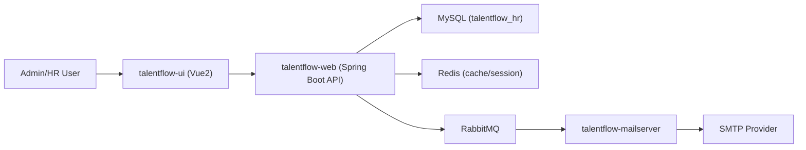

# TalentFlow HR

🔥 A full-stack HR management platform based on Spring Boot + Vue2.  
🚀 Built with multi-module Java backend, Redis cache, RabbitMQ mail workflow, and role-based admin console.  
⭐ Covers employee lifecycle, organization governance, salary account configuration, system notifications, and chat.

[](https://openjdk.org/)
[](https://spring.io/projects/spring-boot)
[](https://v2.vuejs.org/)
[](https://www.mysql.com/)
[](https://redis.io/)
[](https://www.rabbitmq.com/)

---

## Table of Contents

- [1. Project Overview](#1-project-overview)
- [2. What This Repo Delivers](#2-what-this-repo-delivers)
- [3. Directory Naming Migration (Complete)](#3-directory-naming-migration-complete)
- [4. Architecture Overview](#4-architecture-overview)
- [5. Project Structure](#5-project-structure)
- [6. Quick Start](#6-quick-start)
- [7. Build & Run Commands](#7-build--run-commands)
- [8. Configuration Guide](#8-configuration-guide)
- [9. Roadmap](#9-roadmap)
- [10. Upstream Attribution](#10-upstream-attribution)
- [11. License](#11-license)

---

## 1. Project Overview

TalentFlow HR is a rebranded and engineering-hardened fork of the classic `vhr` HR system.

This repository focuses on:

- product identity unification (`TalentFlow HR`)
- Java package migration to `io.liuzhuoran.talentflow`
- multi-module Maven coordinate migration to `talentflow-*`
- environment-driven configuration for MySQL / Redis / RabbitMQ / SMTP
- frontend branding and repository-level structure standardization

---

## 2. What This Repo Delivers

### 2.1 Core business capabilities

- employee profile management
- department / job level / position / role management
- salary account and employee salary binding
- role-based menu authorization
- online chat + notification entry
- asynchronous onboarding email delivery (RabbitMQ + mail worker)

### 2.2 Engineering capabilities

- multi-module backend with clear boundaries (`model/mapper/service/web/mailserver`)
- Flyway migration script included
- standalone SQL seed script (`talentflow_hr.sql`)
- environment variable override support for local and deployment environments

---

## 3. Directory Naming Migration (Complete)

All key project directories have been renamed from legacy names to TalentFlow naming.

| Legacy Name | Current Name |
|---|---|
| `vhr/` | `talentflow-platform/` |
| `vhr/vhrserver/` | `talentflow-platform/talentflow-server/` |
| `vhr/mailserver/` | `talentflow-platform/talentflow-mailserver/` |
| `vhr/vhrserver/vhr-model/` | `talentflow-platform/talentflow-server/talentflow-model/` |
| `vhr/vhrserver/vhr-mapper/` | `talentflow-platform/talentflow-server/talentflow-mapper/` |
| `vhr/vhrserver/vhr-service/` | `talentflow-platform/talentflow-server/talentflow-service/` |
| `vhr/vhrserver/vhr-web/` | `talentflow-platform/talentflow-server/talentflow-web/` |
| `vuehr/` | `talentflow-ui/` |

---

## 4. Architecture Overview



---

## 5. Project Structure

```text
.
├── talentflow-platform/
│   ├── pom.xml                          # Backend aggregator
│   ├── talentflow-mailserver/           # Mail worker module
│   └── talentflow-server/
│       ├── pom.xml                      # Server aggregator
│       ├── talentflow-model/            # Domain models/constants
│       ├── talentflow-mapper/           # MyBatis mappers/xml
│       ├── talentflow-service/          # Core business services
│       └── talentflow-web/              # API + security + static resources
├── talentflow-ui/                       # Vue2 frontend
├── talentflow_hr.sql                    # Full seed SQL (optional import)
├── .env.example                         # Local env template
└── docker-compose.yml                   # MySQL/Redis/RabbitMQ local bootstrap
```

---

## 6. Quick Start

### 6.1 Requirements

- JDK 8+
- Maven 3.8+
- Node.js 16+ (recommended)
- MySQL 8.0+
- Redis 6+
- RabbitMQ 3+

### 6.2 Start infra quickly (optional)

```bash
docker compose up -d
```

### 6.3 Create and import database

```bash
mysql -u root -p -e "CREATE DATABASE talentflow_hr CHARACTER SET utf8mb4 COLLATE utf8mb4_unicode_ci;"
mysql -u root -p talentflow_hr < talentflow_hr.sql
```

### 6.4 Load env values

```bash
set -a
source .env.example
set +a
```

### 6.5 Build backend

```bash
cd talentflow-platform
mvn -ntp clean package
```

### 6.6 Run backend modules

Terminal 1:

```bash
cd talentflow-platform
mvn -ntp -pl talentflow-server/talentflow-web spring-boot:run
```

Terminal 2:

```bash
cd talentflow-platform
mvn -ntp -pl talentflow-mailserver spring-boot:run
```

### 6.7 Run frontend

```bash
cd talentflow-ui
npm install
npm run serve
```

Frontend default: `http://localhost:8080`  
Backend default: `http://localhost:8081`

---

## 7. Build & Run Commands

```bash
# Backend compile only
cd talentflow-platform
mvn -ntp compile

# Backend tests
cd talentflow-platform
mvn -ntp test

# Frontend dev
cd talentflow-ui
npm run serve

# Frontend production build
cd talentflow-ui
npm run build
```

If you deploy in single-jar mode, copy built frontend assets to:

`talentflow-platform/talentflow-server/talentflow-web/src/main/resources/static/`

---

## 8. Configuration Guide

Main backend config:

- `talentflow-platform/talentflow-server/talentflow-web/src/main/resources/application.yml`
- `talentflow-platform/talentflow-mailserver/src/main/resources/application.properties`

Supported env variables include:

- `TF_DB_*`
- `TF_REDIS_*`
- `TF_RABBITMQ_*`
- `TF_MAIL_*`
- `TF_SERVER_PORT`
- `TF_MAIL_SERVER_PORT`
- `TF_STORAGE_PUBLIC_BASE_URL`

See `.env.example` for a complete baseline.

---

## 9. Roadmap

1. Upgrade Java baseline to 17 and align Spring Boot target version.
2. Migrate frontend from Vue2/Vue CLI to Vue3/Vite.
3. Add integration tests for auth, employee lifecycle, and mail retry chain.
4. Remove or regenerate legacy static bundle artifacts under backend `static/`.

---

## 10. Upstream Attribution

This project originated from [lenve/vhr](https://github.com/lenve/vhr) and has been structurally and semantically migrated for TalentFlow branding and engineering consistency.  
Please review upstream licensing obligations before redistribution.

---

## 11. License

Apache License 2.0 (same as upstream unless otherwise noted).
